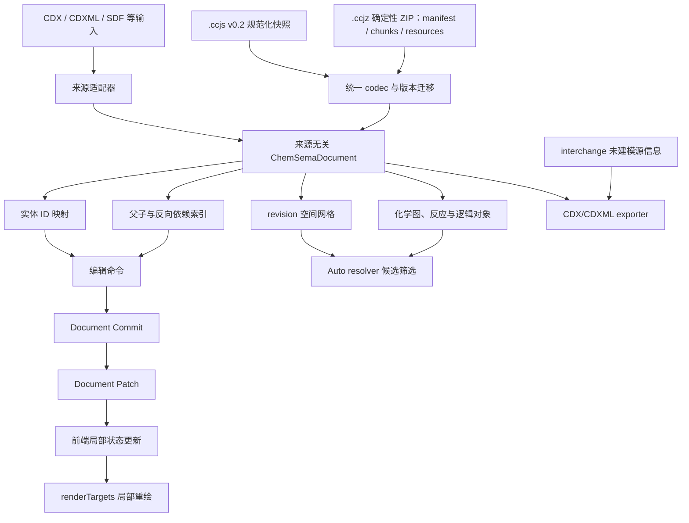

# CCJS 当前文档架构、格式比较与新格式必要性

状态：CCJS 0.2 的当前设计总论。规范字段以 [CCJS 0.2 规范](./format-v0.2.zh-CN.md) 为准，物理封装以 [CCJZ Container v1](./protocol/ccjz-container-v1.md) 为准，恢复语义以 [Recovery Journal v1](./protocol/journal-v1.md) 为准；[稳定化架构与发布门禁](./ccjs-v0.2-stability-architecture.zh-CN.md) 区分已经实现的能力和仍未完成的稳定性要求。

## 摘要

CCJS 的价值不在于“把 XML 换成 JSON”。如果只做语法替换，CDXML 已经成熟、生态更大，开发新格式没有充分理由。CCJS v0.2 的必要性来自一个更具体的空缺：现有主流格式通常分别擅长分子身份、连接表、交换语义、绘图保真或大型科学数组，却很少同时提供来源无关的化学页面模型、稳定对象身份、显式层级与关系、局部编辑协议、严格版本治理和未知源字段的可逆保存。

当前方案不是在所有维度击败所有格式，而是采用分层协作：

- CCJS 负责可编辑化学文档的语义快照；
- CCJZ 负责大文档的确定性分块封装和二进制资源边界；
- CDX/CDXML 负责 ChemDraw 互操作，并通过 interchange 层尽量无损往返；
- MOL/SDF、SMILES、InChI、CML 负责各自擅长的结构交换、标识和语义场景；
- HDF5 或专业谱学格式负责真正的大型、多维、分块实验数据；
- Document Patch 负责编辑器高频局部同步，不把运行时历史塞进文件。
- Recovery Journal 负责崩溃恢复，不冒充 undo history 或多人协同协议。

## 1. 当前架构

### 1.1 权威快照

磁盘上的 v0.2 使用平铺 scene entities 和独立 hierarchy。对象内容只出现一次，归属只由 hierarchy 决定。绘制层级只由 zIndex 决定；reading order 是另一项可选语义。relations 只表达跨实体关系，不兼任树或空间索引。

内核可以为了成熟编辑算法使用嵌套运行视图，但读写必须经过统一 codec。这样文件模型可以规范化，而不要求一次性重写数百处编辑、渲染和导入逻辑。前端也只在引擎边界建立可丢弃的嵌套投影，不会把它写回 v0.2。

### 1.2 化学模型

场景中的 molecule 是放置对象；原子、键、立体化学、标签和分子内连接属于 molecule resource。reactionSchemes、chemicalProperties 和 logicalObjects 是与图形并列的一等语义，不藏在任意 meta 中。SMILES 和 InChI 可以作为来源无关表示或标识，但不承担页面布局。

### 1.3 索引

文件持久化 hierarchy，因为它是所有权真相。ID map、parentById、relation reverse、resource users、render cache 和空间网格可以从文件重建，因此属于运行时。

当前空间索引采用 96 pt 均匀网格：按 revision 从渲染 primitive 和对象选择包围盒汇总 scene bounds，先查网格候选，再做精确包围盒相交。单对象或查询跨越超过 4096 个网格时不再枚举全部 cell，而改用常驻候选或有界精确扫描，避免异常坐标造成内存爆炸。自动反应关系已使用该索引筛选对象，然后继续执行箭头轴、角色、距离与歧义判断。未来如实测显示密度分布不适合网格，可以替换 R-tree；文件格式无需变化。

这里不把 `link` 和 `group` 提升为两个拥有第二份对象内容的平行数据库。v0.1 的 `group.children` 已升级为 v0.2 `hierarchy`：它是单归属、无环、可验证的树索引；group 自身仍是 scene entity。v0.1 的 `links` 已升级为类型化 `relations`：端点按稳定 ID 引用实体，表达反应参与、标注、几何约束等跨对象语义。空间先后、阅读顺序和绘制顺序分别由派生空间索引、`reading` 和 `zIndex` 负责。这样既得到树和关系索引的查询优势，又不会让“对象内部 children”与“文件头索引”同时声称自己是权威。

### 1.4 精确更新

过去前端在命令后获取完整 document JSON，再局部重绘；这仍有 O(document size) 的跨边界传输。现在命令结果之外增加 Document Patch：只返回变化实体、依赖资源、关系作用域、样式和必要层级，高级语义区只在相关命令中出现。补丁以 `beforeRevision` 为应用前置条件；乱序、缺口和旧后端都会回退完整同步。前端应用补丁后按目标 ID 请求 renderTargets。

这解决的是大文件编辑陷阱，而不是假设 JSON 本身支持随机访问。打开普通 `.ccjs` 仍需解析完整快照；`.ccjz` 则通过 scene chunk、内容寻址资源和 seek/range reader 提供磁盘局部 I/O。大型 HDF5/Zarr/FID 可作为带哈希的 opaque attachment 按范围读取。

## 2. 为什么 ChemDraw 选择 XML，为什么这不否定 CCJS

恢复的 [CDX/CDXML 格式说明](https://iupac.github.io/IUPAC-FAIRSpec/cdx_sdk/General.htm) 明确说明：ChemDraw 文档由任意深度的对象和属性嵌套组成；CDXML 是同一 CDX 数据的 XML 编码，文本形式更容易看出嵌套。其 [CDX 二进制说明](https://iupac.github.io/IUPAC-FAIRSpec/cdx_sdk/IntroCDX.htm) 也说明对象可以包含属性和其他对象，对象 ID 最初只要求容器内唯一，但实际引用机制促使实现尽量使用全局唯一 ID。

因此 XML 在当时是合理设计：

- 原始模型本来就是对象树；
- XML 原生表达元素嵌套、属性和文本；
- 当时 XML 工具、Schema 和企业互操作成熟；
- CDXML 需要与二进制 CDX 尽量一一对应，而不是重新设计语义。

这不代表树形物理存储永远最适合现代编辑器。CDXML 的嵌套同时把“对象内容”和“对象归属”耦合起来。移动对象到另一 group 会改变大段祖先文本；局部补丁、稳定 diff、跨对象关系和 AI 按 ID 操作都更困难。CCJS 保留树的语义，却把树变成独立索引。这是数据规范化，不是拒绝层级。

## 3. 与主流格式的比较

| 格式 | 最擅长 | 对完整化学页面的不足 | CCJS 的位置 |
|---|---|---|---|
| CDX/CDXML | ChemDraw 绘图对象、页面和往返生态 | 来源模型与 ChemDraw 强绑定；物理嵌套；现代局部更新协议和公开治理有限 | 原生语义快照，稳定 ID、独立 hierarchy/relations；通过 interchange 保留未建模字段 |
| MOL/SDF | 分子连接表、坐标、批量记录与属性 | 不负责复杂页面、通用图形、跨分子反应排版和编辑器状态 | molecule resource 可与其互转；CCJS 负责文档层 |
| SMILES | 紧凑分子线性表示与搜索输入 | 不保存页面几何；普通 SMILES 也不是完整文档 | 作为 molecule 的表示/导入导出，不作为文档容器 |
| InChI | 非专有、结构派生的物质标识 | 官方定位是 identifier，不是绘图或页面格式 | 作为身份层；CCJS 保留绘图、编辑和文档语义 |
| CML | 开放 XML 化学语义、字典和 convention | 通用性强，但不是为高频二维绘图编辑和局部 render patch 专门设计 | CCJS 更窄、更贴近编辑器；CML 在通用标准化语义上更成熟 |
| KET/Ketcher JSON | Web 分子编辑器的原生 JSON | 主要围绕 Ketcher 内部/化学编辑模型，跨来源无损层和 CCJS 的页面治理目标不同 | 是最接近的同类；CCJS 必须靠严格 schema、迁移、关系和互操作证据建立差异 |
| HDF5 | 多维 dataset、chunk、压缩、部分/并行 I/O | 二进制 API 和复杂图结构不适合作为可 diff 的 Web 页面文档；不自带化学编辑语义 | 适合大型谱学/FID 资源，不适合替代主 scene snapshot |

### 3.1 CDX/CDXML

CDX/CDXML 的对象覆盖非常广，[预定义对象清单](https://iupac.github.io/IUPAC-FAIRSpec/cdx_sdk/AllCDXObjects.htm) 包括 fragment、node、bond、text、graphic、reaction scheme、spectrum、TLC、geometry、constraint 和 chemical property。CCJS 目前不能诚实声称覆盖更广或生态更好。

CCJS 的实际优势是：来源无关 native 字段、稳定全局对象身份、平铺实体、显式单归属层级、类型化 relation、严格格式门禁、JSON Schema、Document Patch 和开放实现。短板由 interchange 和逐项 CDX/CDXML 验证账本缓解，但只有测试覆盖的字段才能宣称无损。

### 3.2 CML

[CML 官方 FAQ](https://www.xml-cml.org/documentation/FAQ.html) 将 CML 定位为覆盖化学核心概念的 XML language，并用 convention 和字典实现机器可处理语义。CML 在开放化学语义和长期标准积累上优于 CCJS。

CCJS 不应复制一个更小的 CML。它的合理边界是“可编辑二维化学文档与应用运行边界”：明确 scene、render、selection ownership、source interchange 和 incremental patch。若数据交换只需要通用化学语义，优先导出 CML；若需要继续编辑一整页带图形、关系和排版的文档，才使用 CCJS。

### 3.3 MOL/SDF、SMILES 与 InChI

[IUPAC 的 InChI 页面](https://iupac.org/who-we-are/divisions/division-details/inchi/) 将 InChI 定义为用于连接数据集合的非专有化学物质 identifier。它的目标不是保存二维布局、箭头、文字和页面对象。MOL/SDF 与 SMILES 同样主要服务分子或记录，而不是完整绘图文档。

所以 CCJS 不与它们竞争“哪个分子表示最好”。正确做法是让一个 molecule 同时拥有可编辑图、可验证的 SMILES/InChI 和标准连接表出口，把文档层与身份层分开。

### 3.4 KET

[Ketcher 官方仓库](https://github.com/epam/ketcher) 将 KET 描述为原生内部 JSON 格式。KET 证明“化学编辑器使用 JSON native format”并不新颖。CCJS 若只有 JSON 语法就没有创新。

差异必须由可验证能力构成：完整页面对象、独立 hierarchy/relations、source-neutral native fields、CDX/CDXML interchange、格式版本门禁、Schema、局部 patch、CLI agent bundle 和跨桌面/Office 路径。没有测试和规范支撑的部分不能算优势。

### 3.5 HDF5

[HDF5 官方 Group 文档](https://support.hdfgroup.org/documentation/hdf5/latest/_h5_g__u_g.html) 说明 group/link 构成层级；简单情况是树，通用情况可以是含多链接和环的有根有向图。其 group 实现会在小组的紧凑存储与大组的索引结构之间切换。[HDF5 文件格式说明](https://portal.hdfgroup.org/documentation/hdf5/latest/_f_m_t1.html) 还描述了 dataset layout、chunk 和 B-tree 等底层结构。

CCJS 不应模仿 HDF5 的所有能力。化学页面需要单一归属、确定选择和可理解 diff；允许多父和环会显著增加编辑语义。HDF5 的真正优势是大型数组和部分 I/O，因此 NMR 的原始 FID、多维矩阵和长采样数据可以作为当前 `.ccjz` 的 opaque attachment 保存，也可以保留为外部 HDF5/Zarr 资源；CCJS 保存媒体类型、校验和、单位、轴、形状与引用。容器提供 attachment byte-range 读取，但不重新实现 HDF5 的 dataset 查询语言。

## 4. 当前可证明的优势

以下优势已经有实现或门禁支撑：

1. **规范化 scene**：写出端只生成 v0.2 flat entities；scene entity 不含 children。
2. **显式树索引**：验证单归属、父类型、存在性、可达性和无环；加载时重建运行视图。
3. **版本治理**：错误 name/version/unit/profile 被拒绝；v0.1 显式迁移；保存只写 v0.2。
4. **Schema + 语义验证**：公开 JSON Schema 覆盖形状，Rust 验证补齐跨引用、关系签名和层级不变量。
5. **类型化关系**：未知 relation kind 和错误端点角色被拒绝；group ownership 不再与 relation 混用。
6. **局部更新**：Document Patch 传递变化实体、资源、关系作用域和层级；前端优先补丁而非完整 document sync。
7. **派生空间索引**：revision 网格查询经过精确 bbox 复核；Auto reaction resolver 已使用候选索引。
8. **可移植子文档**：clipboard document 和 CLI bundle 按选择与依赖输出自包含文档，而不是字节截断。
9. **来源保真策略**：native 字段与 interchange 的权威边界明确，CDX/CDXML 未建模信息不必被静默丢弃。
10. **确定性容器**：CCJZ v1 提供 manifest、哈希、scene chunks、内容寻址资源、opaque attachments、路径安全检查和旧 gzip 只读迁移。
11. **恢复边界**：桌面同目录 journal 与浏览器 IndexedDB journal 使用可校验哈希链；只有保存并重新验证成功后才清除旧日志。
12. **独立读取证据**：Rust、浏览器 JavaScript 和无 Rust 绑定的 Python reader 已能交叉装配同一语义文档。

## 5. 仍然存在的短板

### 5.1 `.ccjz` 容器的边界

当前 `.ccjz` 是 `chemsema.container.v1` 确定性 ZIP：固定 MIME、manifest、SHA-256、scene JSONL chunks、内容寻址 JSON resources 和二进制 attachments。Rust、浏览器 JavaScript 和独立 Python reader 已做交叉合规验证；旧 gzip `.ccjz` 仅保留读取兼容。

它不是 HDF5 的替代物：CCJZ 管理文档语义、索引和资源边界，HDF5/Zarr 继续管理大型科学数组。底层容器读取器可以只读 manifest、单个 scene chunk、单个资源或 attachment byte range；当前编辑器打开文档时仍会装配完整 CCJS 快照，因此“容器支持局部 I/O”不等于“所有编辑路径已经按可见区域懒加载”。普通 `.ccjs` 始终是完整文本快照。

### 5.2 打开 `.ccjs` 仍是整份解析

flat entities 改善结构、diff 和局部变更，但不让通用 JSON 解析器获得磁盘随机访问。大文件首次打开仍是 O(file size)。解决方法是容器分块、流式 parser 或专用数据库，不应谎称 hierarchy 已解决全部 I/O。

### 5.3 生态与长期稳定性不足

CDXML、SDF、CML 和 HDF5 有更长历史和更多消费者。CCJS 已建立 conformance 命令、Rust/JavaScript/Python 交叉读取、公开迁移政策和 corpus 门禁；生态成熟度仍远低于这些格式，因此每次格式变更仍必须保持跨实现 fixtures 与旧版本读取验证。

### 5.4 Schema 不能证明化学正确

JSON Schema 能验证结构，不能证明价态、立体化学、反应角色或 CDXML 视觉往返。必须继续保留化学 sanitizer、InChI/SMILES 交叉检查、CDX/CDXML 字段账本和逐文件视觉门禁。

### 5.5 局部补丁需要 revision 缺口处理

Document Patch 必须按 beforeRevision 顺序应用。跨进程丢包或后端版本不支持时，前端需要完整刷新。当前已用 hash-chain journal 记录提交前补丁，桌面使用同目录 `.journal` 旁车、浏览器使用 IndexedDB，并在验证保存后压缩清除；这仍是崩溃恢复，不是多用户协同编辑协议。

### 5.6 稳定化工具仍有未完成项

当前 CLI 已提供 `validate`、`canonicalize`、`migrate`、`schema` 和 `conformance`，但 `validate` 的三个等级还没有全部达到长期合同：错误报告尚未系统提供稳定 error code、JSON Pointer/entry、规范条款和信息损失等级；`chemical` 目前主要复用引擎装载不变量；`roundtrip` 目前验证规范 CCJS 重装配，不等同于对每个声明目标格式执行语义与视觉往返。CCJZ 底层已有分块/range reader 和流式大附件写入，但编辑器可见区懒加载、未变 entry 的 copy-on-write 复用，以及浏览器单 entry 超过经典 ZIP 上限时的 Zip64 策略仍需完成。上述项目保留在发布门禁和 Roadmap 中，不应写成已经交付。

## 6. 为什么仍有必要开发 CCJS

开发新格式只有在以下约束同时成立时才合理：

- 产品需要编辑整个化学页面，而不只是一个分子；
- 需要同时支持 Web、桌面、Office、CLI 和 agent 的同一语义模型；
- 需要按稳定 ID 做小范围命令、选择、diff、复制和渲染；
- 需要跨 CDXML、CDX、SDF、图像/OCR 等来源，不让任何一种输入格式成为内核；
- 需要在原生建模尚未完成时仍保留源格式信息；
- 愿意承担 Schema、迁移、合规测试和长期兼容成本。

ChemSema 满足这些条件。因此 CCJS 的必要性不是“JSON 比 XML 新”，而是“现有格式之间缺少一个来源无关、编辑器原生、关系明确并支持精确更新的化学文档层”。

## 7. 结论

CCJS v0.2 采用的是规范化混合模型：实体平铺，树和关系显式，专业化学图保持专业，空间索引派生，更新协议独立，源格式未知信息可逆保存。它在化学页面编辑与 agent 可寻址性上有真实优势；已经具备三种读取实现，但在生态、长期第三方采用和大型二进制数据专用能力上仍弱于成熟格式。

因此最可信的定位不是“取代所有化学格式”，而是“连接它们并承担可编辑化学文档这一层”。只有持续用 Schema、迁移、真实 corpus、局部性能基准和跨格式往返证据补足短板，这个优势才成立。
